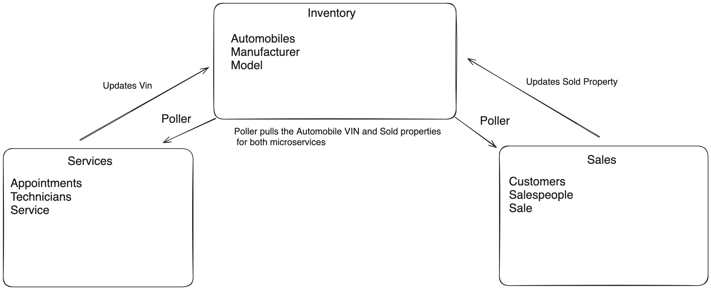

# CarCar

CarCar is a website designed for overseeing various elements of car dealerships. It enables management of data on car manufacturers, vehicle models and stock, mechanics, maintenance bookings, sales staff, buyers, and transactions. CarCar prides itself on its easy-to-navigate interface, developed using React.


Team:

* Gabe Wickert - Sales
* Yutong Ye - Service

###Project Set up 💻

1.Fork the repo at https://gitlab.com/GabrielWickert/project-beta

2.Clone your fork to your projects directory.

3.Change directory into the repository directory.

4.Run the follwing commands to set up docker envirnment 

```
docker volume create beta-data
docker compose build
docker compose up
```
 5.Enter "localhost:3000" in your web browser to see the front-end of the React app in action, showcasing its dynamic and interactive features.

### Project Diagram



## Service microservice

The Service microservice features three main models: Technician, AutomobileVo, and Appointment. Although there is an AutomobileVO model that includes a "vin" field within my models file, this field isn't linked as a Foreign Key to the "vin" field in the Appointment model. Within the service directory, there's a subdirectory named "poll," which contains a file called 'poller.py.' This file contains the logic for fetching necessary data (vin and sold fields) from the inventory microservice.

The primary goal of the Service microservice is to keep track of technicians, oversee the status of service appointments, and manage a service history record, enabling searches for appointments using a vehicle's vin number. Furthermore, it enhances functionality by allowing the addition of new technicians and providing an appointment scheduling form to streamline the process of setting up new appointments.

###Service API Endpoints


## Sales microservice

Explain your models and integration with the inventory
microservice, here.


